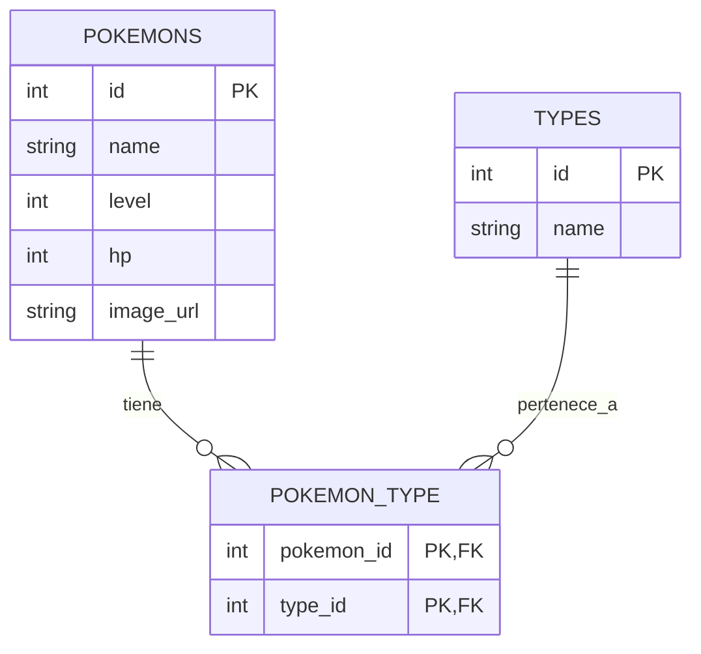

# Pokémon API

Proyecto full-stack de gestión de Pokémon, desarrollado como ejercicio de curso. Permite crear, consultar, editar y eliminar Pokémon y sus Tipos elementales, con una relación muchos-a-muchos entre ambas entidades y soporte para subir una imagen por Pokémon.

## Descripción

La aplicación se compone de dos partes:

- **Backend**: API REST construida con FastAPI y SQLAlchemy, siguiendo una arquitectura estilo MVC (`models` / `controllers` / `views`), con base de datos SQLite.
- **Frontend**: interfaz en HTML5, CSS3 y JavaScript vanilla (sin frameworks), que consume la API mediante Axios. Incluye una pantalla de documentación de la propia API, gestión visual (CRUD) de Pokémon y Tipos, búsqueda y filtrado por tipo, y diseño responsive (mobile-first).

## Tecnologías utilizadas

**Backend**
- Python 3
- FastAPI
- SQLAlchemy (ORM)
- Pydantic (validación de datos)
- SQLite
- Uvicorn (servidor ASGI)
- python-multipart (subida de imágenes)

**Frontend**
- HTML5 / CSS3
- JavaScript (vanilla, sin frameworks)
- Axios (peticiones HTTP)
- Material Symbols (iconografía)
- Google Fonts

## Estructura del proyecto

```
pokemon-api/
├── backend/
│   ├── app/
│   │   ├── models/          # Pokemon, Type (tablas SQLAlchemy)
│   │   ├── controllers/     # lógica CRUD
│   │   ├── views/           # routers / endpoints REST
│   │   ├── database.py      # conexión a la base de datos
│   │   ├── main.py          # punto de entrada de FastAPI
│   │   └── schemas.py       # validación con Pydantic
│   ├── static/pokemon/      # imágenes subidas
│   └── requirements.txt
└── frontend/
    ├── components/          # fragmentos HTML (header, paneles, modales)
    ├── js/                  # lógica de la app y componentes JS reutilizables
    ├── css/
    └── index.html
```

## Diagrama entidad-relación (DER)



`pokemon_type` es la tabla puente que resuelve la relación muchos-a-muchos: un Pokémon puede tener varios Tipos, y un Tipo puede pertenecer a varios Pokémon.

## Guía de instalación local

### Requisitos previos
- Python 3.10+
- Un navegador con extensión Live Server (o cualquier servidor estático) para el frontend

### 1. Clonar el repositorio
```bash
git clone https://github.com/jorgem610/pokemon-api.git
cd pokemon-api
```

### 2. Backend

```bash
cd backend
python -m venv venv
```

Activar el entorno virtual:
- Windows: `venv\Scripts\activate`
- macOS/Linux: `source venv/bin/activate`

Instalar dependencias:
```bash
pip install -r requirements.txt
```

Arrancar el servidor:
```bash
uvicorn app.main:app --reload
```

La API queda disponible en `http://127.0.0.1:8000`, y la documentación interactiva (Swagger) en `http://127.0.0.1:8000/docs`.

### 3. Frontend

Abre la carpeta `frontend/` con VSCode y lánzala con la extensión **Live Server** (clic derecho sobre `index.html` → "Open with Live Server"), o sirve la carpeta con cualquier servidor estático. No se puede abrir `index.html` directamente haciendo doble clic (protocolo `file://`), ya que el sistema de componentes usa `fetch()` para cargar los fragmentos HTML, y eso requiere un servidor real.

## Configuración de entorno

El proyecto no requiere variables de entorno adicionales: la base de datos es un archivo SQLite local (`backend/pokemon.db`) que se genera automáticamente al arrancar el servidor por primera vez.

Si necesitas cambiar la URL de la API que usa el frontend (por ejemplo, si despliegas el backend en otra dirección), edítala en `frontend/js/state.js`:
```js
const API_URL = "http://127.0.0.1:8000";
```

## Documentación de endpoints

### Pokémon

| Método | Endpoint | Descripción |
|---|---|---|
| GET | `/pokemon/` | Lista todos los Pokémon |
| GET | `/pokemon/{id}` | Obtiene un Pokémon por ID |
| POST | `/pokemon/` | Crea un nuevo Pokémon |
| PUT | `/pokemon/{id}` | Actualiza un Pokémon existente |
| DELETE | `/pokemon/{id}` | Elimina un Pokémon |
| POST | `/pokemon/{id}/image` | Sube/reemplaza la imagen de un Pokémon (multipart/form-data) |

**Ejemplo — Crear Pokémon** (`POST /pokemon/`)

Request:
```json
{
  "name": "Charizard",
  "level": 54,
  "hp": 105,
  "type_ids": [1, 2]
}
```

Response `201 Created`:
```json
{
  "id": 1,
  "name": "Charizard",
  "level": 54,
  "hp": 105,
  "image_url": null,
  "types": [
    { "id": 1, "name": "Fuego" },
    { "id": 2, "name": "Volador" }
  ]
}
```

### Tipos

| Método | Endpoint | Descripción |
|---|---|---|
| GET | `/types/` | Lista todos los Tipos |
| GET | `/types/{id}` | Obtiene un Tipo por ID |
| POST | `/types/` | Crea un nuevo Tipo |
| PUT | `/types/{id}` | Actualiza un Tipo existente |
| DELETE | `/types/{id}` | Elimina un Tipo |

**Ejemplo — Crear Tipo** (`POST /types/`)

Request:
```json
{ "name": "Fuego" }
```

Response `201 Created`:
```json
{ "id": 1, "name": "Fuego" }
```

## Autor

Jorge Miguel Macías Vera — [GitHub](https://github.com/jorgem610)